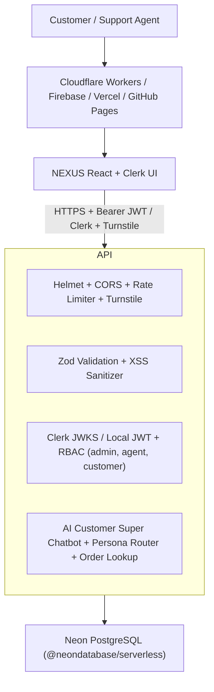

# System Architecture (`ARCHITECTURE.md`)

```mermaid
flowchart TB
    Customer["Customer / Support Agent"] --> Edge["Cloudflare Workers / Firebase / Vercel / GitHub Pages"]
    Edge --> UI["NEXUS React + Clerk UI"]
    UI -->|HTTPS + Bearer JWT / Clerk + Turnstile| API["Express.js API Gateway"]
    subgraph API
        Sec["Helmet + CORS + Rate Limiter + Turnstile"]
        Val["Zod Validation + XSS Sanitizer"]
        Auth["Clerk JWKS / Local JWT + RBAC (admin, agent, customer)"]
        Bot["AI Customer Super Chatbot + Persona Router + Order Lookup"]
    end
    API --> Neon["Neon PostgreSQL (@neondatabase/serverless)"]
```
