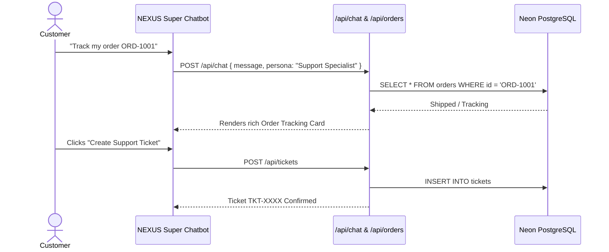

# User Flows (`USER_FLOWS.md`)

## 1. Customer Order Tracking & Ticket Escalation

```mermaid
sequenceDiagram
    actor Customer
    participant UI as NEXUS Super Chatbot
    participant API as /api/chat & /api/orders
    participant DB as Neon PostgreSQL

    Customer->>UI: "Track my order ORD-1001"
    UI->>API: POST /api/chat { message, persona: "Support Specialist" }
    API->>DB: SELECT * FROM orders WHERE id = 'ORD-1001'
    DB-->>API: Shipped / Tracking #1Z999AA101
    API-->>UI: Renders rich Order Tracking Card
    Customer->>UI: Clicks "Create Support Ticket"
    UI->>API: POST /api/tickets
    API->>DB: INSERT INTO tickets
    API-->>UI: Ticket TKT-XXXX Confirmed
```
